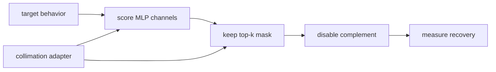

# Prism: Unlocking Language Model Capability Extraction

Authors: Abhishek Mishra, Krishna Pagare

A trained language model holds many capabilities at once, while a deployment
usually asks it to exercise only one. Prism asks whether a named capability can
be made to run through a sparse set of MLP channels while the surrounding
transformer scaffold stays fixed and the rest of the MLP is switched off.

This repository is the public code and artifact index for the paper. It
contains intervention scripts and small receipts, plus the strict loader and
evidence ledger for a physically smaller function-calling substrate. The model
weights remain in a private verification mirror until redistribution provenance
is complete.


## The extraction contract

Attribution is not enough. A channel can correlate with a behavior without
being sufficient to run it. Prism tests sufficiency by keeping a candidate mask,
disabling the complement, and measuring how much of the original behavior
survives under that intervention.



Collimation is the behavior-preserving step that changes where a capability is
carried internally. The key distinction is timing. If collimation runs before
attribution, it can move the sparsity frontier because the mask is found after
the representation changes. If it runs after attribution, the mask is already
fixed, so the adapter can only route more behavior through the surviving
channels.

| regime | order | what it can change | primary camera-ready use |
|---|---|---|---|
| Pre-attribution collimation | collimate -> attribute -> mask | which channels carry the capability | arithmetic |
| Post-attribution collimation | attribute -> mask -> collimate | how much behavior fits through fixed channels | function calling |

## Main release results

| capability | model | intervention claim | released evidence |
|---|---|---|---|
| Two-digit addition | `Qwen2.5-Math-1.5B` | Pre-attribution collimation moves recovery from 29.00% to 91.33% while keeping about 5% of MLP channels. | arithmetic masks, training summaries, and evaluation receipts |
| Function calling | `Qwen3-8B` | A built and privately verified jagged-MLP substrate retains 140,875 channels, 54.77% of total parameters, and `598/671` (`89.12%`) of its same-environment dense parent's normalized-exact score. | physical weights, strict loader, full predictions/diffs, size accounting, and repeated B200 benchmark |

The function-calling count uses PRISM's pinned internal normalized structured
matcher, not the official BFCL leaderboard. The physical artifact is
`598/1007`; its same-environment merged parent is `671/1007`. The historical
`598/664 = 90.06%` comparison crosses model states and is not the primary
compression ratio.

EN-PT translation artifacts remain available as historical provenance, but
translation is not part of the primary camera-ready claim or contribution
surface.

The paper PDF and figure assets are in `paper/`. The claim-to-artifact index is
`docs/ARTIFACT_MANIFEST.json`.

## Repository map

| path | role |
|---|---|
| `code/` | runnable scripts for arithmetic, translation, and BFCL/function-calling experiments |
| `code/src/circuit_tracing/` | shared arithmetic circuit-tracing utilities |
| `code/scripts/` | BFCL filtering, scoring, conditioning, and evaluation scripts |
| `code/configs/` | sanitized configs for released runs |
| `results/` | small result receipts included in git |
| `docs/` | release boundary, data-source notes, terminology, and artifact manifest |
| `paper/` | paper PDF and figure/image assets |

Public legacy checkpoints, generated datasets, raw attribution arrays, adapters,
and full-model outputs are hosted on Hugging Face rather than committed to git.
The Issue #18 physical substrate is the documented exception: its weights are
privately preserved on ModelScope while public redistribution remains blocked.

The Issue #18 physical BFCL verification weights are mirrored privately at
[`tokenbender/prism-bfcl-mace-140875-physical-restricted-v2`](https://modelscope.ai/models/tokenbender/prism-bfcl-mace-140875-physical-restricted-v2).
Their public release remains gated on adapter provenance and a verified Hugging
Face publication receipt. The private repository's `master` revision is mutable;
the ModelScope verification receipt plus the model SHA-256 form the proof surface.
ModelScope exposes no license grant for that restricted repository. The git-sized evidence is in
`results/bfcl/issue18_physical_mace_v1/`.

## Install

Use Python 3.12+.

```bash
uv venv --python 3.12 .venv
source .venv/bin/activate
uv pip install -e ./code
```

The standard-library venv path also works.

```bash
python3 -m venv .venv
source .venv/bin/activate
python -m pip install -e ./code
```

Most experiment reruns require GPU hardware and public model downloads. The
default circuit-tracing tests use `Qwen/Qwen3-0.6B` and CUDA when available.

```bash
cd code
python -m pytest src/circuit_tracing/test_pipeline.py -v
```

Slow edge-attribution and end-to-end tests are opt-in.

```bash
PRISM_RUN_SLOW_TESTS=1 python -m pytest src/circuit_tracing/test_pipeline.py -v
```

## Reproduce

Start with `REPRODUCE.md` for task-level commands. The short version is:

| task family | entry point |
|---|---|
| Arithmetic extraction | `code/src/circuit_tracing/`, `code/train_lora_2digit_kl.py`, and arithmetic evaluation scripts |
| Translation rescue | `code/build_ntrex_en2pt_jsonl.py`, `code/train_masked_kl_conditioning.py`, and translation evaluation scripts |
| Function calling | `code/scripts/load_bfcl_physical_bundle.py`, `code/scripts/benchmark_bfcl_physical_throughput.py`, and the [Issue #19 physical-throughput receipt](results/bfcl/issue19_physical_throughput/README.md) |
| Sparse-inference failure mining | [`sparse-inference-failure-atlas/`](sparse-inference-failure-atlas/) and its [deterministic rebuild commands](sparse-inference-failure-atlas/README.md#reproduce-the-corpus-and-figures) |

The repository keeps small receipts in `results/`. Public Hugging Face artifacts
are pinned by immutable revision SHA in the manifest. The private Issue #18
ModelScope mirror is instead bound by its verification receipt and model hash.

## Public artifacts

| artifact | repository | revision |
|---|---|---|
| Arithmetic generated data, masks, and run receipts | [TokenBender/circuit-discovery](https://huggingface.co/datasets/TokenBender/circuit-discovery) | `4b9fb53fef92550042d8576fe011e99270fdca8b` |
| Arithmetic checkpoints and adapters | [TokenBender/circuit-discovery](https://huggingface.co/TokenBender/circuit-discovery) | `f75ca2f123ce6aaca0e8096918df1ddb34b5d546` |
| EN-PT generated data and run artifacts | [TokenBender/synth-data-en-pt-circuit](https://huggingface.co/datasets/TokenBender/synth-data-en-pt-circuit) | `36ee2512bcabf32f224c34792db4fb1907d711c3` |
| EN-PT adapters and masks | [Occupying-Mars/hy-lora-conditions](https://huggingface.co/Occupying-Mars/hy-lora-conditions) | `8139bf31538727c87c04f9a88b0b0ccaeacb8832` |
| BFCL data and reproduction receipts | [Occupying-Mars/issue49-bfcl-repro-artifacts](https://huggingface.co/datasets/Occupying-Mars/issue49-bfcl-repro-artifacts) | `303db0bddcfb04bebaf07ab4a4dc4c089240c545` |
| BFCL k160 adapter | [Occupying-Mars/issue49-k160-r32-len1024-adapter](https://huggingface.co/Occupying-Mars/issue49-k160-r32-len1024-adapter) | `e5104eee6e9dd0fff11f377b743330429970d672` |
| BFCL k240 adapter | [Occupying-Mars/issue49-k240-r16-adapter](https://huggingface.co/Occupying-Mars/issue49-k240-r16-adapter) | `b9018cc3090b856df701240fd73f9f98c627917c` |
| BFCL full-model reproduction | [TokenBender/issue51-r32-more-online-codex-repro-551-full](https://huggingface.co/TokenBender/issue51-r32-more-online-codex-repro-551-full) | `ff4daac9e49a8f927153c9a04daa9faba2fb5a66` |

## Sparse-inference failure atlas

The [`sparse-inference-failure-atlas/`](sparse-inference-failure-atlas/) package
contains the source-linked **What Breaks for VRAMlets** report in
[Markdown](sparse-inference-failure-atlas/report.md) and
[PDF](sparse-inference-failure-atlas/report.pdf), together with its aggregate
data, figures, and links to the underlying mining artifacts.

## License

This repository is licensed under the Apache License, Version 2.0. See
`LICENSE`.
